# SportsQuip
A front-end website for sports enthusiasts to get their sports accessories and kits of their favourite team and brand. It is built using HTML, CSS, JavaScript and Bootstrap.

## Mockups
#### 1. Mobile Dark Mode
<table>
  <tr>
    <td>
      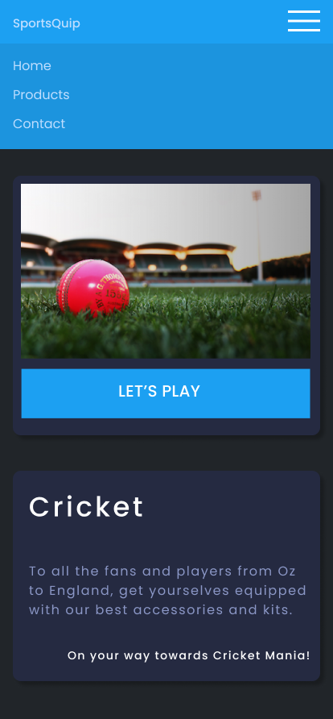
    </td>
    <td>
      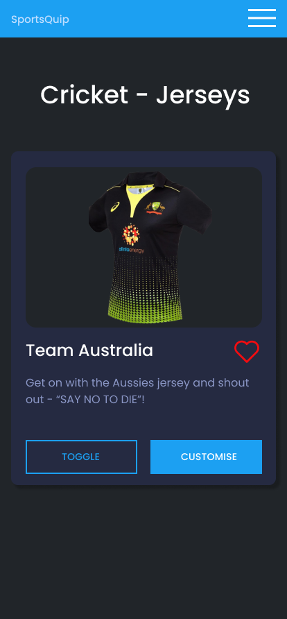
    </td>
    <td>
      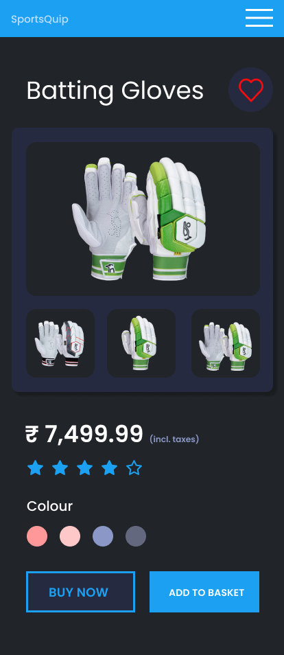
    </td>
  </tr>
</table>

---

#### 2. Desktop Light Mode
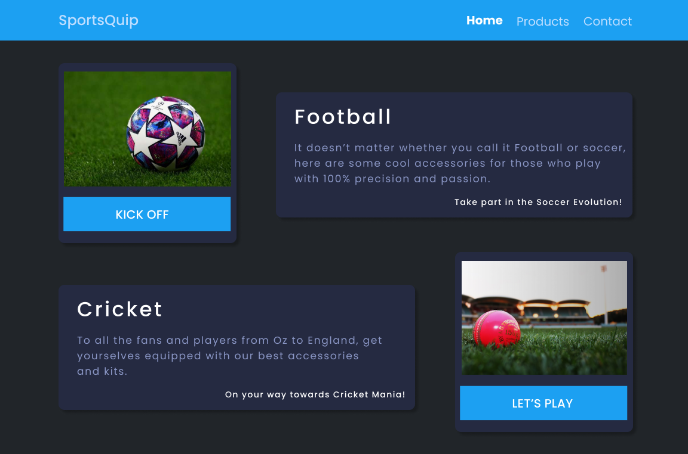
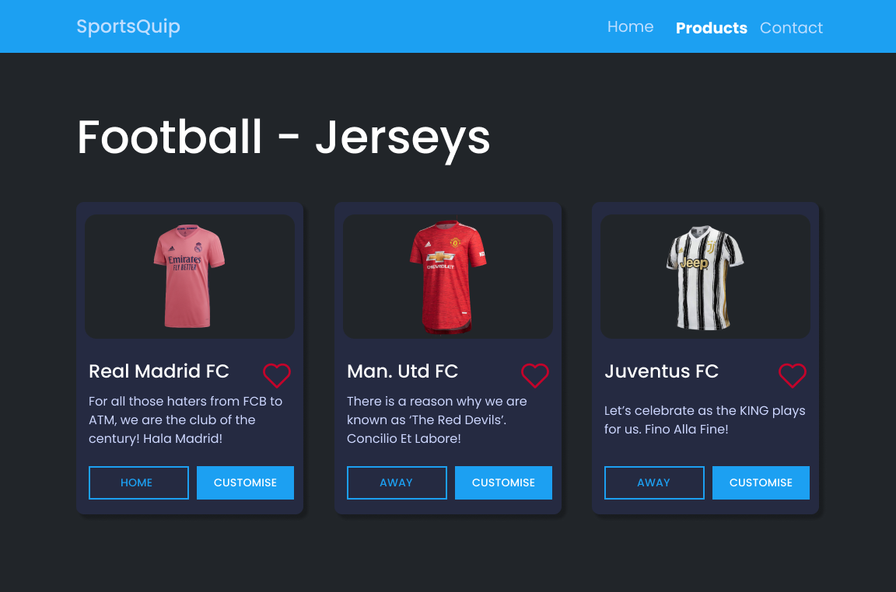
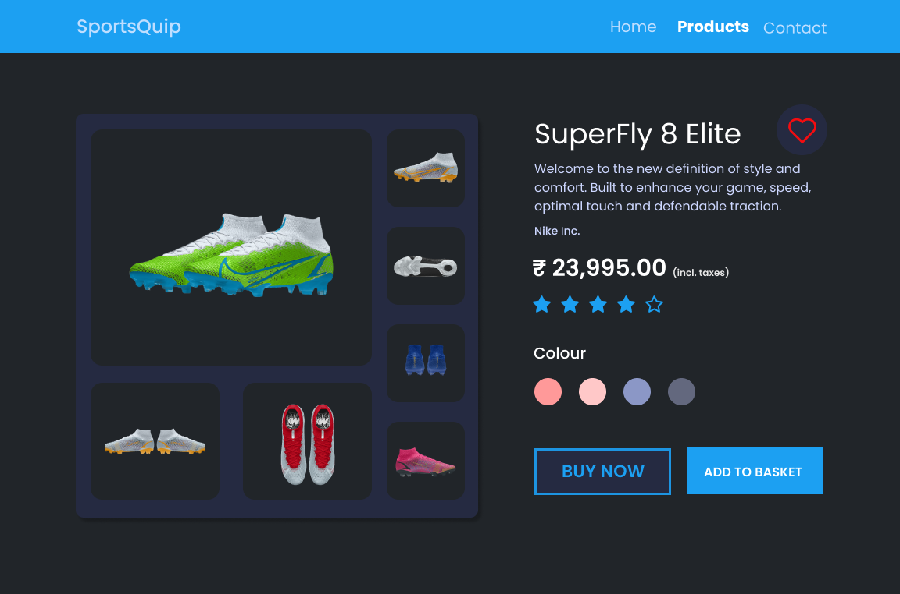

---

#### 3. Mobile Light Mode
<table>
  <tr>
    <td>
      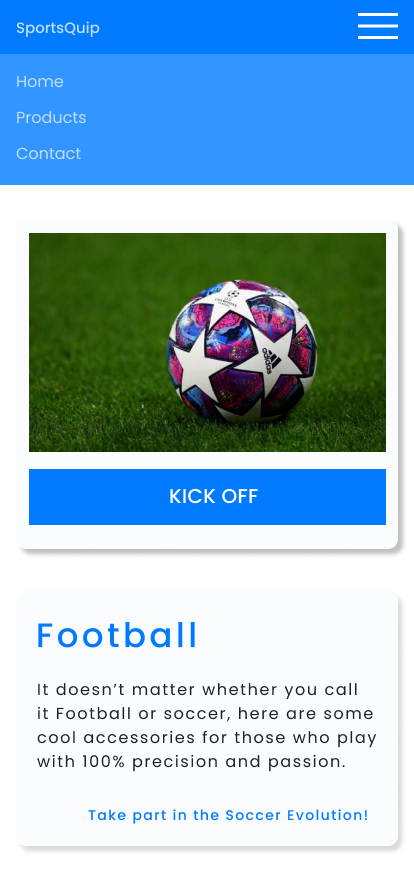
    </td>
    <td>
      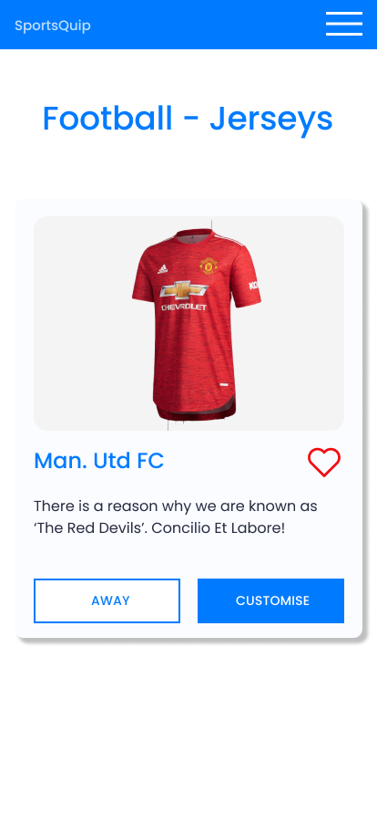
    </td>
    <td>
      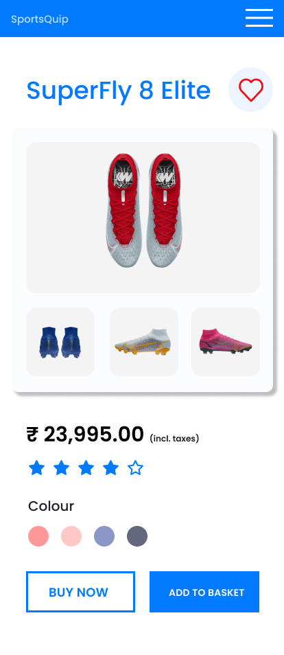
    </td>
  </tr>
</table>

---

#### 4. Desktop Light Mode
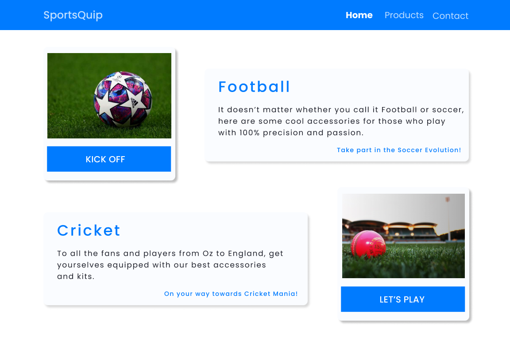
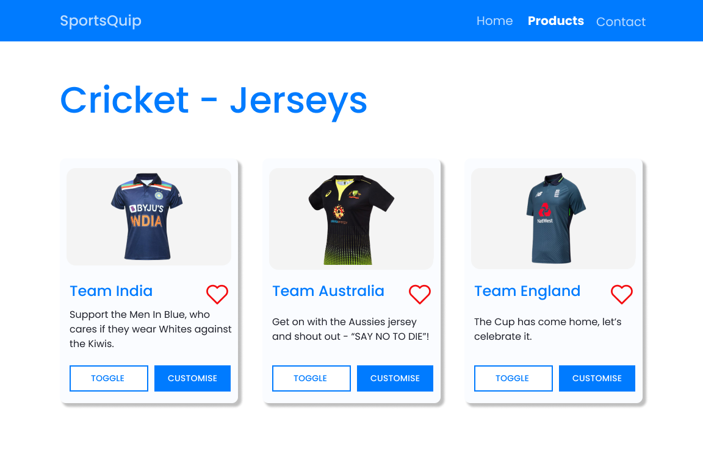
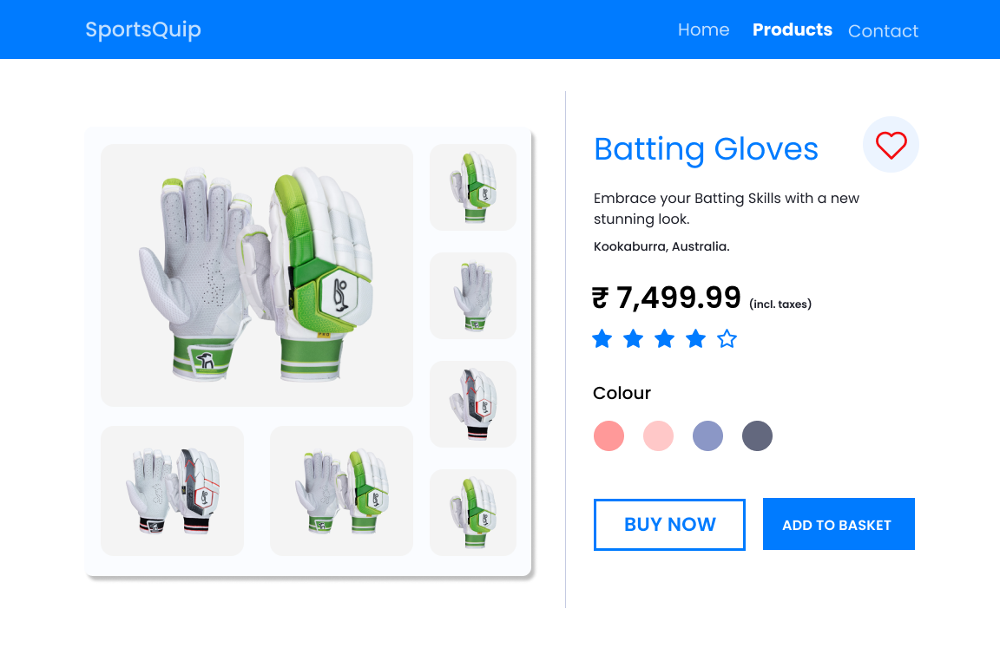
